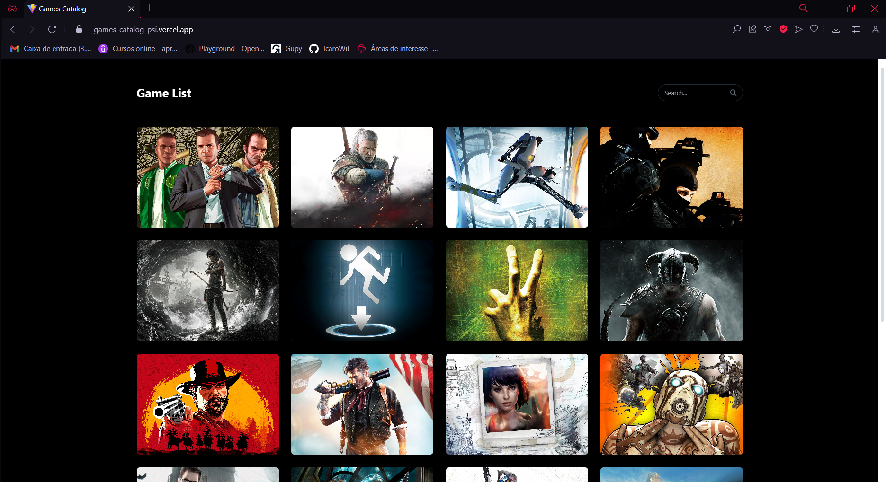
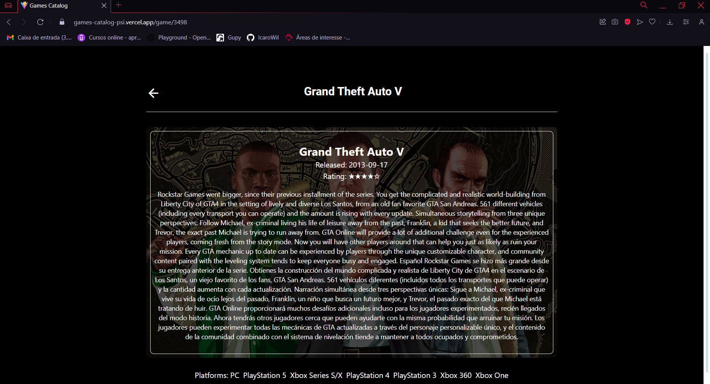

# Games Catalog 

This project consists of a game catalog developed using React with Vite and Tailwind CSS, integrated with the RAWG GAMES API. It is deployed on Vercel and can be accessed via the following link: [Games Catalog](https://games-catalog-psi.vercel.app).

## Technologies Used

- React
- Vite
- Tailwind CSS
- Axios

## Prerequisites

- Node.js installed (v14.x or higher)
- npm or yarn

## How to Run

1. Clone this repository:

git clone https://github.com/IcaroWil/Games-Catalog

2. Access the project directory:

cd games-catalog

3. Install the dependencies:

- Using npm:

npm install react react-dom vite tailwindcss postcss autoprefixer axios react-router-dom @fortawesome/react-fontawesome @fortawesome/free-solid-svg-icons @fortawesome/free-brands-svg-icons

- Using yarn:

yarn add react react-dom vite tailwindcss postcss autoprefixer axios react-router-dom @fortawesome/react-fontawesome @fortawesome/free-solid-svg-icons @fortawesome/free-brands-svg-icons

4. Run the project:

- Using npm:

npm run dev

5. The project will be available at [http://localhost:5173/](http://localhost:5173/) in your browser.

## Project Structure

- `src/components`: React components used in the project.
- `src/styles`: Global styles and project-specific CSS.
- `src/api.js`: File for making calls to the RAWG GAMES API. **Please note that you need to replace `'YOUR_API_KEY'` in `src/api.js` with your  actual RAWG API key.**
- `src/App.jsx`: Main component that sets up the routes and starts the application.

## Features

- Viewing the game list.
- Searching for games by name.
- Detailed viewing of each game.

## Author

Icaro Oliveira <icarofaria11@gmail.com>

## Useful Links

- [API RAWG GAMES](https://rawg.io/apidocs)
- [React Documentation](https://reactjs.org/docs/getting-started.html)
- [Vite Documentation](https://vitejs.dev/guide/)
- [Tailwind CSS Documentation](https://tailwindcss.com/docs)

**Please note:** In `src/components/GameDetails` and `src/api.js`, you need to use your own API key. Replace `'YOUR_API_KEY'` with your actual RAWG API key.

## Application Screenshots

